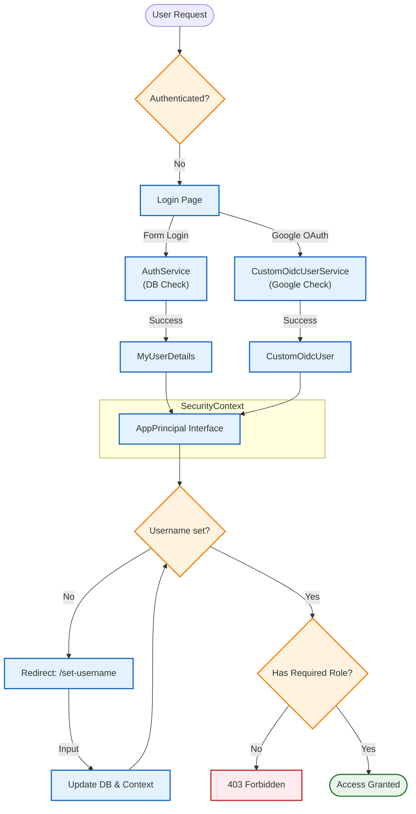

# tutothr

## Start Project
- cp .env.dummy .env
- refill variables
- export $(grep -v '^#' .env | xargs)
- click play in your IDE

## Paths:

### Category:

- (GET) /admin/categories
- (GET) /admin/categories/add
- (GET) /admin/categories/update/{id}
- (POST) /admin/categories/save
- (PUT) /admin/categories/save/{id}
- (DELETE) /admin/categories/delete/{id}

### Courses

- (GET) /courses
- (GET) /courses/{id}
- (GET) /tutor/courses/add
- (GET) /tutor/courses/update/{id}
- (POST) /tutor/courses/save
- (PUT) /tutor/courses/save/{id}

### Chapter

- DELETE /tutor/chapters/delete/{id}

### User

- (GET) /views/users/user-all

## Security Config

Das Projekt nutzt **Spring Security 6** mit einer hybriden Authentifizierungsstrategie.

### Features
*   **Dual Authentication:**
    *   **Form Login:** Klassisch via E-Mail & Passwort (DB-basiert).
    *   **OAuth2 / OIDC:** Login via Google.
*   **Unified Principal:** Egal ob Google oder Form-Login, im Code wird immer gegen das Interface `AppPrincipal` gearbeitet.
*   **Role-Based Access Control (RBAC):**
    *   `/admin/**` -> Nur für `ROLE_ADMIN`
    *   `/tutor/**` -> Nur für `ROLE_TUTOR`
    *   `/student` -> Authentifizierte User
*   **Onboarding Flow:** OAuth-User ohne Benutzernamen werden durch einen `UsernameCheckFilter` abgefangen und gezwungen, einen Usernamen zu setzen.



### Wichtige Komponenten
| Klasse | Funktion |
| :--- | :--- |
| `SecurityConfig` | Zentrale Konfiguration der FilterChain, Public Endpoints und Login-Handler. |
| `AppPrincipal` | Gemeinsames Interface für `MyUserDetails` (Form) und `CustomOidcUser` (Google). |
| `CustomOidcUserService` | Lädt Google-User und erstellt/matcht sie mit der lokalen Datenbank. |
| `UsernameCheckFilter` | Prüft nach dem Login, ob das Feld `username` gesetzt ist. |

### Environment Variables
Für OAuth2 müssen folgende Variablen in der `.env` gesetzt sein:
```properties
GOOGLE_CLIENT_ID=deine-client-id
GOOGLE_CLIENT_SECRET=dein-client-secret


## Relations


```mermaid
graph TD
    BaseDTO --> |extends| DTO
    Controller --> |uses| Service

    Service --> |uses| PermissionService
    Service --> |uses| Repository
    Controller --> |uses| DTO

    Mapper
    Service --> |has| Mapper

````
## Logic
<div style="display: grid; grid-template-column: auto">
<div style="overflow-x: auto; max-width: 100%; border: 1px solid #ccc; padding: 8px;">

```mermaid
graph TD
    Request --> SecurityConfig --> Authenticated{Authenticated?} 
    Authenticated --> |yes|getRole[getRoles <br> Admin, Tutor, Student]
    Authenticated --> CheckPermission 
    getRole --> CheckPermission
    CheckPermission --> |NotAuthenticated|RedirectLogin
    CheckPermission --> |Authenticated|403
````
</div>
<div>

```mermaid
graph TD
    Request --> SecurityConfig --> Authenticated{Authenticated?} 
    Authenticated --> |yes|getRole[getRoles <br> Admin, Tutor, Student]
    Authenticated --> CheckPermission 
    getRole --> CheckPermission
    CheckPermission --> |NotAuthenticated|RedirectLogin
    CheckPermission --> |Authenticated|403
````
</div>
</div>

## ClassDiagramm
<div style="overflow-x: auto; max-width: 100%; border: 1px solid #ccc; padding: 8px;">

```mermaid
---
title: ClassDiagramm
---
classDiagram

    BaseService --|>  CategoryService
    BaseService --|> CourseService
    class BaseService {
        <<abstract>>
        - repository : MyBaseRepository
        - fields : List~Field~
        + update(dto) D
        + getFields() List~Field~
        + findDTOById(id) D
        + findById(id) E
        + deleteById(id)
        + save(entity)
        + getAllDTOs() List~D~
        + mapToDTO(entity) D
        + mapToEntity(dto) E
    }

    class CategoryService {
        + mapToDTO(entity) CategoryDTO
        + mapToEntity(dto) Category
        // ...weitere Methoden...
    }

    class CourseService {
        + mapToDTO(entity) CourseDTO
        + mapToEntity(dto) Course
        // ...weitere Methoden...
    }
        class BaseDTO {
        <<abstract>>
        - id : Long
        - validationErrors : Map~String, String~
        - formFields : List~Field~
        + getId() Long
        + setId(id : Long)
        + getValidationErrors() Map~String, String~
        + setValidationErrors(errors : Map~String, String~)
        + addValidationError(field : String, message : String)
        + getFormFields() List~Field~
    }

    class CategoryDTO {
        - title : String
        - description : String
        + getTitle() String
        + setTitle(title : String)
        + getDescription() String
        + setDescription(description : String)
    }

    class CourseDTO {
        - title : String
        - description : String
        - price : float
        - chapters : List~ChapterDTO~
        + getTitle() String
        + setTitle(title : String)
        + getDescription() String
        + setDescription(description : String)
        + getPrice() float
        + setPrice(price : float)
        + getChapters() List~ChapterDTO~
        + setChapters(chapters : List~ChapterDTO~)
    }
````

</div>
