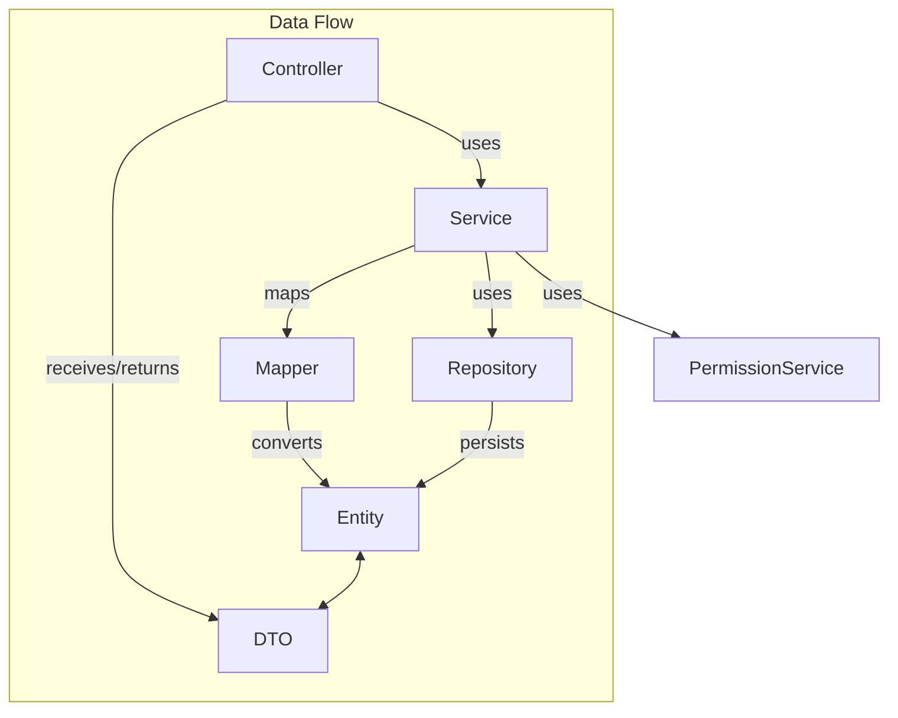
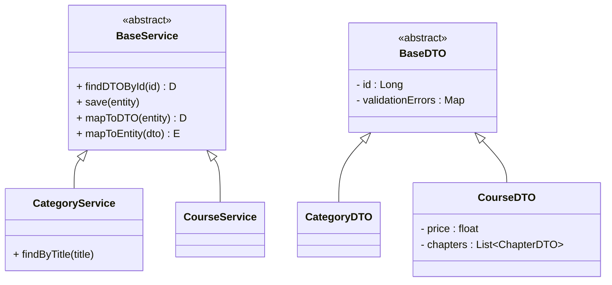
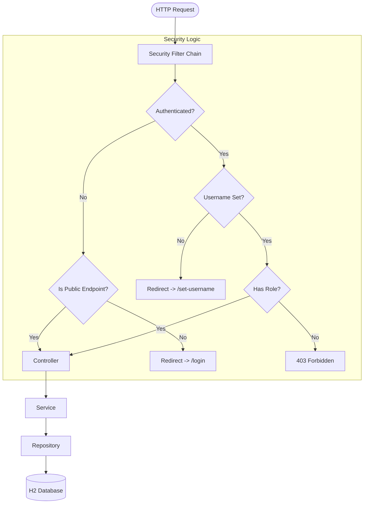

# Architecture Overview

## 🛠 Tech Stack
*   **Language:** Java 21
*   **Framework:** Spring Boot 3.x
*   **Database:** H2 (In-Memory) / JPA (Hibernate)
*   **Frontend:** Thymeleaf (Server-Side Rendering) + Bootstrap
*   **Security:** Spring Security 6 (OAuth2 & Form Login)

---

## 🏗 Layered Architecture
Das Projekt folgt einer klassischen Schichtenarchitektur (Layered Architecture), um eine saubere Trennung von Verantwortlichkeiten (SoC) zu gewährleisten.

| Layer | Components | Responsibility |
| :--- | :--- | :--- |
| **Presentation** | `Controller`, `DTOs`, `Thymeleaf Templates` | Nimmt HTTP-Requests entgegen, validiert Input (DTOs) und rendert HTML-Views. |
| **Business** | `Service`, `PermissionService` | Enthält die Geschäftslogik, Transaktionssteuerung und Autorisierungs-Checks. |
| **Data Access** | `Repository`, `Entity` | Abstrahiert den Datenbankzugriff via Spring Data JPA. |

### Dependency Graph

---

## 🧩 Design Patterns

### 1. Generic Base Implementation
Um Code-Duplizierung zu vermeiden, nutzt das Projekt generische Basisklassen für CRUD-Operationen.
*   **`BaseEntity`**: Enthält ID, CreatedAt, UpdatedAt.
*   **`BaseService<D, E>`**: Implementiert Standard-Logik (Save, Update, Delete, Find) für DTOs (`D`) und Entities (`E`).
*   **`MyBaseRepository`**: Erweitert `JpaRepository`.

### 2. DTO Pattern (Data Transfer Object)
Wir trennen strikt zwischen Datenbank-Modellen (`Entity`) und View-Modellen (`DTO`).
*   **Entities**: Spiegelt die DB-Tabelle wider (mit `@Entity`, `@Table`).
*   **DTOs**: Enthält Validierungslogik (`@NotBlank`, `@Size`) und nur die Daten, die das Frontend braucht.

### 3. Class Hierarchy
Hier sieht man, wie die generischen Services vererbt werden:

---

## 🔄 Request Lifecycle & Security Logic

Jeder Request durchläuft eine Kette von Sicherheitsüberprüfungen, bevor er den Controller erreicht.

