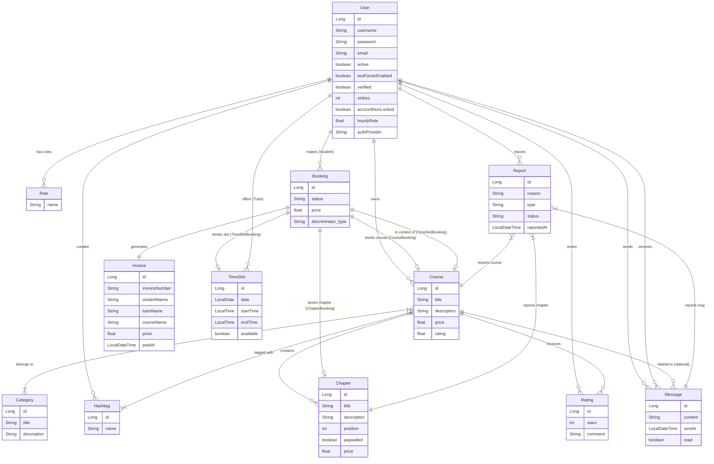

# ER Model - TutOTHr Project

This document describes the Entity-Relationship model of the application based on the current JPA Entities.

```mermaid
erDiagram
    %% User & Auth
    User {
        Long id
        String username
        String password
        String email
        boolean active
        boolean twoFactorEnabled
        boolean verified
        int strikes
        boolean accountNonLocked
        float hourlyRate
        String authProvider
    }

    Role {
        String name
    }

    User ||--o{ Role : "has roles"

    %% Content: Courses, Categories, Chapters
    Course {
        Long id
        String title
        String description
        float price
        float rating
    }

    Category {
        Long id
        String title
        String description
    }

    Chapter {
        Long id
        String title
        String description
        int position
        boolean paywalled
        float price
    }

    Hashtag {
        Long id
        String name
    }

    %% Relationships - User & Content
    User ||--o{ Course : "owns"
    User ||--o{ Hashtag : "creates"
    
    %% Relationships - Course Content
    Course }|--|{ Category : "belongs to"
    Course }|--|{ Hashtag : "tagged with"
    Course ||--o{ Chapter : "contains"
    
    %% Ratings & Feedback
    Rating {
        Long id
        int stars
        String comment
    }
    
    User ||--o{ Rating : "writes"
    Course ||--o{ Rating : "receives"

    %% Booking System (Inheritance Strategy: Single Table)
    Booking {
        Long id
        String status
        float price
        String discriminator_type
    }
    
    Invoice {
        Long id
        String invoiceNumber
        String studentName
        String tutorName
        String courseName
        float price
        LocalDateTime paidAt
    }
    
    TimeSlot {
        Long id
        LocalDate date
        LocalTime startTime
        LocalTime endTime
        boolean available
    }

    %% Booking Relationships
    User ||--o{ Booking : "makes (Student)"
    Booking ||--|| Invoice : "generates"
    
    %% Subtypes of Booking relations
    Booking ||--o| Course : "books course (CourseBooking)"
    Booking ||--o| Chapter : "books chapter (ChapterBooking)"
    Booking ||--o| TimeSlot : "books slot (TimeSlotBooking)"
    Booking ||--o| Course : "in context of (TimeSlotBooking)"

    %% TimeSlot Relation
    User ||--o{ TimeSlot : "offers (Tutor)"

    %% Communication & Moderation
    Message {
        Long id
        String content
        LocalDateTime sentAt
        boolean read
    }

    Report {
        Long id
        String reason
        String type
        String status
        LocalDateTime reportedAt
    }

    User ||--o{ Message : "sends"
    User ||--o{ Message : "receives"
    Course ||--o{ Message : "related to (optional)"

    User ||--o{ Report : "reports"
    Report }|--|| Message : "reports msg"
    Report }|--|| Course : "reports course"
    Report }|--|| Chapter : "reports chapter"
```
