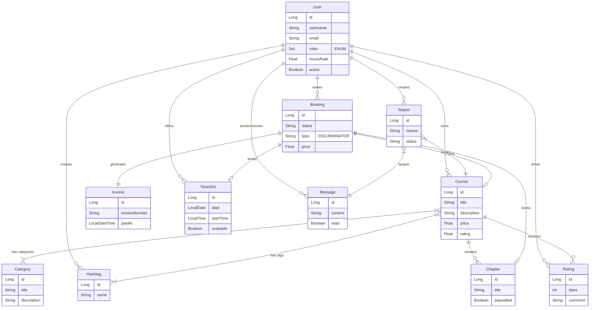

# ER Model - TutOTHr Project

## Physisches Datenmodell (Krähenfuß-Notation)

Das technische Datenbankschema inkl. Attributen.

```mermaid
erDiagram
    %% --- USER MANAGEMENT ---
    User {
        Long id
        String username
        String email
        Set roles "ENUM"
        Float hourlyRate
        Boolean active
    }

    %% --- COURSE MANAGEMENT ---
    Course {
        Long id
        String title
        String description
        Float price
        Float rating
    }
    Chapter {
        Long id
        String title
        Boolean paywalled
    }
    Category {
        Long id
        String title
        String description
    }
    Hashtag {
        Long id
        String name
    }

    %% --- BOOKING SYSTEM ---
    Booking {
        Long id
        String status
        String type "DISCRIMINATOR"
        Float price
    }
    Invoice {
        Long id
        String invoiceNumber
        LocalDateTime paidAt
    }
    TimeSlot {
        Long id
        LocalDate date
        LocalTime startTime
        Boolean available
    }

    %% --- SOCIAL & MODERATION ---
    Rating {
        Long id
        Int stars
        String comment
    }
    Message {
        Long id
        String content
        Boolean read
    }
    Report {
        Long id
        String reason
        String status
    }

    %% === RELATIONSHIPS ===

    %% Creation
    User ||--o{ Course : "owns"
    User ||--o{ Hashtag : "creates"
    User ||--o{ TimeSlot : "offers"

    %% Content Structure
    Course }|--|{ Category : "has categories"
    Course }|--|{ Hashtag : "has tags"
    Course ||--o{ Chapter : "contains"

    %% Commerce
    User ||--o{ Booking : "makes"
    Booking ||--|| Invoice : "generates"
    
    %% Interactions
    User ||--o{ Rating : "writes"
    Course ||--o{ Rating : "receives"
    
    User ||--o{ Message : "sends/receives"
    
    User ||--o{ Report : "creates"
    Report }|--|| Message : "targets"
    Report }|--|| Course : "targets"

    
    %% Polymorphic Booking Targets
    Booking ||--o| Course : "books"
    Booking ||--o| Chapter : "books"
    Booking ||--o| TimeSlot : "books"
```
