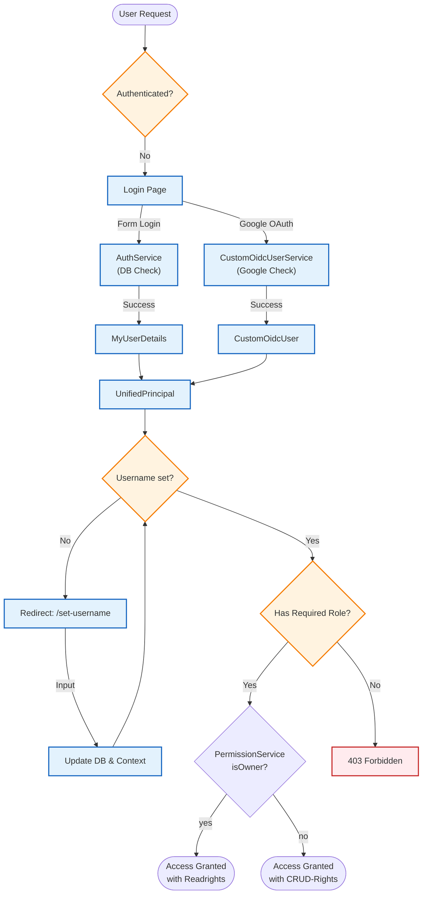

# Security Concept

## 🛡 Overview
Das Projekt setzt auf **Spring Security 6** und implementiert eine **hybride Authentifizierungsstrategie**, die klassische Logins mit modernen OAuth2/OIDC-Verfahren kombiniert.

*   **Framework:** Spring Security 6.x
*   **Standards:** OAuth2, OIDC, BCrypt
*   **Session:** Stateful (JSESSIONID)

---

## 🔐 Authentication (AuthN)

Wir unterstützen zwei parallele Wege, um die Identität eines Nutzers festzustellen.

### 1. Local Auth (Form Login)
*   **Credential Storage:** E-Mail & BCrypt-gehashtes Passwort in der Datenbank.
*   **Provider:** `DaoAuthenticationProvider` via `AuthService`.
*   **Security Measure:** User mit `AuthProvider.GOOGLE` können sich **nicht** per Passwort einloggen (Schutz vor Empty-Password-Attacks).

### 2. Social Auth (Google OIDC)
*   **Provider:** Google Identity Platform.
*   **Flow:** Authorization Code Flow.
*   **Mapping:** Google-User werden beim ersten Login automatisch in der lokalen DB angelegt (`CustomOidcUserService`).

### 🏗 Unified Principal Architecture
Damit die Applikation nicht wissen muss, woher der User kommt, werden beide Login-Arten auf ein gemeinsames Interface gemappt.

| Login Type | Implementation | Interface |
| :--- | :--- | :--- |
| Form Login | `MyUserDetails` | `AppPrincipal` |
| Google Login | `CustomOidcUser` | `AppPrincipal` |

**Vorteil:** Im Code kann immer `((AppPrincipal) authentication.getPrincipal()).getDbUser()` aufgerufen werden.

---

## 🚦 Authorization (AuthZ)

Der Zugriff wird über **Role-Based Access Control (RBAC)** gesteuert.

### Role Hierarchy
| Rolle | Beschreibung | Zugriff |
| :--- | :--- | :--- |
| `ROLE_ADMIN` | Systemadministrator | Voller Zugriff auf `/admin/**` (Kategorien, User-Verwaltung) |
| `ROLE_TUTOR` | Lehrender | Zugriff auf `/tutor/**` (Kurse erstellen, Eigene Kurse Bearbeiten, Eigene Kapitel verwalten) |
| `ROLE_STUDENT` | Lernender | Zugriff auf  (Kurse ansehen, Profil) |

### Public Endpoints
Folgende Pfade sind ohne Login erreichbar (Whitelist):
*   `/login`, `/register`
*   Static Resources (`/css/**`, `/js/**`, `/images/**`)

---

## 🔄 Authentication Flow

Der folgende Ablauf zeigt, wie ein Request verarbeitet wird und wie der **Onboarding-Zwang** (Username setzen) technisch umgesetzt ist.

---

## 🧩 Key Components

| Komponente | Beschreibung |
| :--- | :--- |
| `SecurityConfig` | Konfiguriert die `SecurityFilterChain`, CSRF, und Public Endpoints. |
| `UsernameCheckFilter` | Ein `OncePerRequestFilter`, der nach dem Login prüft, ob der User einen Usernamen hat. Falls nicht -> Redirect. |
| `CustomOidcUserService` | Erweitert den Standard-OIDC-Service, um Google-User in die eigene DB zu synchronisieren. |
| `AuthProvider` | Enum (`LOCAL`, `GOOGLE`) zur Unterscheidung der Login-Quelle im `User`-Entity. |
